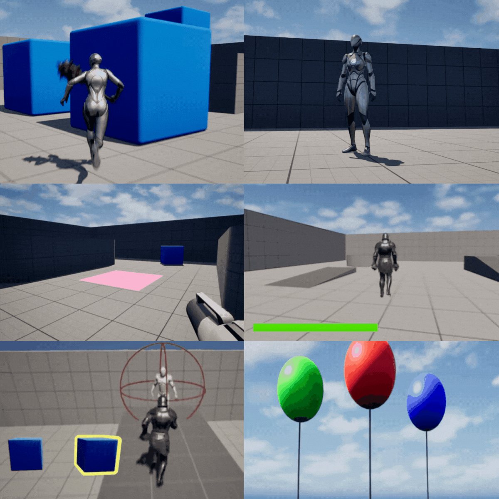
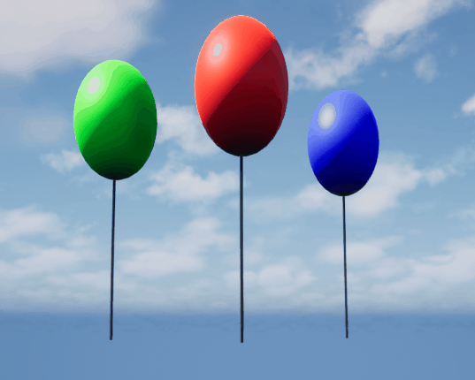

# 🧩 Unreal Engine Blueprint Showcase — Volume 4

A curated collection of **Unreal Engine 5.5.4** mini-projects — each one a focused, standalone system demonstrating clean, production-ready Blueprint design.
This sandbox contains **Projects 1–6**, wrapped together as a complete learning pack.
Each system is lightweight, modular, and built to scale into full gameplay features.

---

## 🎞️ Project Gallery

Explore the projects below 👇
Each entry includes a **Blueprint workflow**, **GIF preview**, and **feature breakdown** — perfect for learning, prototyping, or integrating directly into your own UE projects.

---

# 🗡️ Project 1 – Melee + Break Stuff Mini Demo (UE5)

This project showcases a lightweight melee test setup in Unreal Engine 5.5.4, focused on clean animation blending, upper-body attack layering, and simple breakable props. It’s a fast, practical sandbox to experiment with melee hits, weapon collision, and real-time destruction — without building a full combat system.

---

## 🖼️ Preview

---

## 🧱 Features

- **Imported Animations**

  - Two attack animations retargeted to SK_Mannequin
  - Clean retargeting for Third Person compatibility

- **Animation Blueprint Setup**

  - **Anim Montages** created for both attacks
  - **Cached Pose (Attacks)** for clean reuse
  - **Layered Blend Per Bone** (from spine_01 upward)
  - **DefaultSlot** for montage playback

- **Weapon Setup**

  - Weapon mesh attached to **hand_r**
  - Corrected transforms for natural positioning
  - Capsule Collision added to detect strike overlaps

- **Input Mapping**

  - Left Mouse → Attack 1
  - Right Mouse → Attack 2

- **Breakable Props**
  - Geometry Collections created for destructible objects
  - Fracture Mode configured with uniform fracture pattern
  - Bone colors disabled for clean visuals
  - **Remove on Sleep** used for automatic debris cleanup

---

## 🚀 Result

Press **Play**, swing the weapon, and objects break instantly on hit.
Animations blend smoothly, collisions feel responsive, and the destruction loop is fully Blueprint-driven and modular.

---

# 🎭 Project 2 – Custom Headshake Animation (UE5)

This project demonstrates how to create a fully custom animation inside Unreal Engine 5.5.4 using Control Rig, Sequencer, and Animation Blueprints. You’ll animate a clean headshake gesture, bake it into an Animation Sequence, and blend it into gameplay without disrupting locomotion.

---

## 🖼️ Preview

---

## 🧱 Features

- **Control Rig Workflow**

  - MM_Idle duplicated into **MM_Headshake**
  - Keyframed head rotation sequence in Sequencer
  - Smooth neutral → up → down → neutral animation pass

- **Bake & Export**

  - Animation baked from Sequencer to an **Animation Sequence**
  - Clean curves with proper looping behavior

- **Montage Setup**

  - AnimMontage generated for MM_Headshake
  - Adjustable play rate for timing control

- **Gameplay Integration**

  - Keyboard **1** mapped to trigger montage
  - Plays on DefaultSlot for simple insertion

- **Animation Blueprint Layering**
  - **Cached Pose (Headshake)**
  - **Layered Blend Per Bone** targeting **neck_01**
  - Blends cleanly into walk/run/jump movement

---

## 🚀 Result

Press **1** to fire the headshake animation.
It layers perfectly onto movement using upper-body blending, giving you expressive character gestures with zero interruption to locomotion.

---

# 🌐 Project 3 – Level Switching with Open Level by Name (UE5)

This project demonstrates a clean, Blueprint-only level switching system using overlap triggers to instantly move between the Third Person and First Person template maps. Ideal for rapid prototyping or building multi-map hubs.

---

## 🖼️ Preview

---

## 🧱 Features

- **BP_ToFirstPerson Trigger Actor**

  - Simple Plane mesh for visibility
  - Box Collision for overlap detection
  - Opens **FirstPersonMap** on player overlap

- **First Person Content Pack**

  - Added directly into the Third Person project
  - Ensures both maps are available for loading

- **Blueprint Logic**

  - **Open Level (by Name)** for instant switching
  - Exact match of map name to prevent load errors

- **BP_ToThirdPerson Trigger**

  - Duplicate of the first trigger
  - Sends player back to **ThirdPersonMap**

- **Two-Way Travel**
  - Zero UI
  - Zero delays
  - No GameMode changes
  - Simple, fast level cycling using overlaps

---

## 🚀 Result

Walk onto the trigger plane to swap maps instantly.
Walk onto the return trigger to go back.
A clean two-way teleport system for tests, prototypes, or hub transitions.

---

# ⚡ Project 4 – Skyrim-Inspired Sprint & Stamina System (UE5)

This project builds a **Skyrim-style sprint/stamina system** inside Unreal Engine 5.5.4. Sprinting drains stamina, plays armor-clank audio, boosts FOV, and triggers tired breathing when exhausted. Stamina regenerates when resting, and a UI bar visualizes the entire cycle.

---

## 🖼️ Preview

---

## 🧱 Features

- **Character Setup**

  - Third Person template character used as base
  - Mesh swapped to **SKM_MidPoly** (Juggernaut)
  - Mesh transform adjusted for correct orientation

- **Audio Components**

  - **Armor** loop for running
  - **Tired** breathing for exhaustion
  - Both set to **Auto Activate = False**

- **Core Variables**

  - **isSprinting** (bool)
  - **Stamina** = 100
  - **MaxStamina** = 100

- **StartRunning Function**

  - Max Walk Speed set to **600**
  - Armor audio **Fade In (0.5s)**
  - Camera FOV set to **80**
  - isSprinting = true

- **StopRunning Function**

  - Walk speed restored to **150**
  - Camera FOV returned to **90**
  - Armor audio **Fade Out (0.5s)**
  - isSprinting = false

- **Stamina Regeneration**

  - **Regen** event created
  - Adds +1 stamina per tick using **Clamp**
  - Stops regenerating when stamina = max
  - Only runs when **not sprinting**

- **Stamina Drain**

  - **Drain** event created
  - Subtracts –1 stamina per tick
  - Loop continues only while **isSprinting = true**
  - When stamina hits **0**:
    - Auto-calls **StopRunning**
    - Tired breathing **Fade In (0.5s)** plays instantly

- **UI Stamina Bar**

  - `WBP_UI` created with Progress Bar
  - Bound to **Stamina / MaxStamina**
  - Positioned with bottom-left anchor
  - Updates automatically during play

- **Event Graph Integration**
  - Begin Play → calls **Regen**
  - Begin Play → creates & adds UI to viewport
  - Left Shift (Pressed) → **StartRunning**
  - Left Shift (Released) → **StopRunning**
  - StartRunning → calls **Drain**
  - StopRunning → calls **Regen**

---

## 🚀 Result

Hold **Left Shift** to sprint with speed boost, armor sounds, and FOV tightening.
Stamina drains dynamically, the character becomes exhausted when empty, breathing kicks in, and regeneration restarts when resting.
The UI bar tracks everything in real time — a clean, immersive Skyrim-inspired stamina loop.

---

# ✨ Project 5 – Mesh Outline Highlight System (UE5)

This project builds a flexible **mesh outline system** inside Unreal Engine 5.5.4 using unlit masked materials, world-position offset, and Blueprint-driven proximity triggers. It highlights objects when the player approaches, making it ideal for interactables, pickups, and environmental cues.

---

## 🖼️ Preview

---

## 🧱 Features

- **M_Outline Material**

  - **Blend Mode: Masked** for sharp silhouette edges
  - **Shading Model: Unlit** for consistent color regardless of lighting
  - **Two Sided** enabled for full mesh coverage
  - **EditableColor (Vector Parameter)** connected to Emissive Color
  - **TwoSidedSign → OneMinus** used for the opacity mask
  - **VertexNormalWS × Thickness (Scalar Parameter)** to push the outline outward

- **Material Instances**

  - Instances created for unique styles
  - Example: **M_Thick_Yellow** for stronger, more visible outlines
  - Thickness and color exposed through parameters
  - Can be applied per-object for custom styles

- **Overlay Material Application**

  - Assigned via the **Overlay Material** slot in the Details panel
  - Works on static meshes, props, and interactables
  - Clean overlay effect without modifying the base material

- **BP_Outlined_Manny Blueprint**

  - Blueprint Actor containing a Static Mesh (Manny)
  - Added **Sphere Collision** for proximity detection
  - **OnComponentBeginOverlap** → sets overlay to outline material
  - **OnComponentEndOverlap** → clears overlay (None)
  - Enables context-sensitive highlighting for interactables

---

## 🚀 Result

Walk into the collision area and the outline appears.
Step away and it disappears.
A clean, flexible highlight system perfect for pickups, interactables, and environmental cues.

---

# Project 6 — Floating Balloon System

## 🖼️ Preview

## 🧱 Features

### Balloon Blueprint (BP_Balloon)

- **Static Mesh Setup**

  - Sphere mesh assigned from Starter Content
  - Non-uniform scale applied
    - **X:** 0.6
    - **Y:** 0.6
    - **Z:** 0.9
  - Simulate Physics enabled
  - Gravity disabled for floaty behavior

- **Balloon String**

  - Cable Component added and renamed **Balloon String**
  - Width reduced to **2.0** for thin string appearance
  - **Attach End** disabled for natural cable sway
  - Custom black material (**M_Black**) created and assigned
    - Constant3Vector converted to parameter (Edit Color)

- **Physics Constraint**

  - Constraint added to DefaultSceneRoot
  - Component Name 1 set to **Balloon**
  - **Linear Limits**
    - X Motion: Free
    - Y Motion: Free
    - Z Motion: Limited
    - Limit set to **200**
  - Provides realistic tether behavior and upward float boundary

- **Upward Force Logic**
  - Add Force at Location applied every Tick
  - Force values:
    - **X:** 0
    - **Y:** 0
    - **Z:** 22000
  - Uses world location for responsive physical interaction

### Material Instances for Balloon Colors

- Material Instances created from **M_Black**
- **Edit Color** parameter enabled and customized
- Three variants created (e.g., Red, Blue, Yellow)
- Instances applied to placed BP_Balloon actors for visual variety

## 🚀 Result

Multiple color-variant balloons float naturally, sway gently, and react to player movement with soft, realistic physics behavior — all while staying tethered by a dynamic, physics-driven string.
